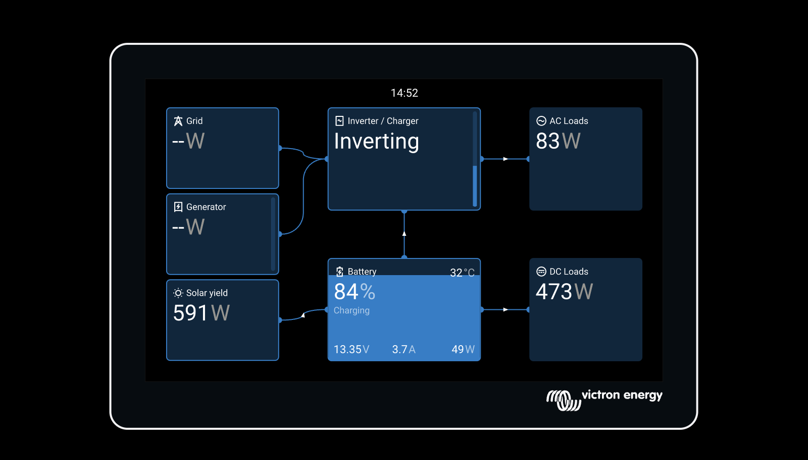
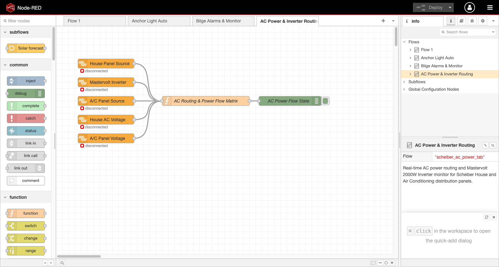

# AC Power Distribution, Transfer Panels & Inverters

This document details the vessel's 230V Alternating Current (AC) distribution architecture, the Scheiber physical switch panels, the MasterVolt 2000W and Victron 375W inverters, and how their real-time states are decoded and published to Venus OS (Cerbo GX) and Node-RED.

---

## 1. System Architecture Overview

The vessel has two independent AC distribution panels / branch circuits:
1. **House AC Distribution Panel**: Powers general 230V domestic outlets, galley equipment, battery chargers, and onboard conveniences.
2. **Air Conditioning (A/C) AC Distribution Panel**: Dedicated high-power circuit for the vessel's climate control systems.

### Inverters
- **MasterVolt 2000W Inverter**: High-power inverter dedicated to supplying the **House AC** distribution bus when off-grid and without the generator. It does not power the Air Conditioning panel.
- **Victron Phoenix 375W Inverter**: Standalone inverter dedicated to continuous **Starlink** power, connected directly via VE.Direct into Venus OS.

```text
               ┌── [ Shore Power (Grid) ] ──┐
               ├── [ Onboard Generator   ] ──┤
               │                            ▼
               │                ┌──────────────────────┐
               ├───────────────►│  A/C Switch Panel    │──► Air Conditioning (230V)
               │                │ (Off/Shore/Generator)│    [CAN: 0x02400B90 & 0x02040B90]
               │                └──────────────────────┘
               │
               │                ┌──────────────────────┐
               ├───────────────►│  House Switch Panel  │──► House Sockets / Appliances (230V)
               │                │ (Off/Shore/Gen/Inv)  │    [CAN: 0x02400B88 & 0x02040B88]
               │                └──────────────────────┘
               │                            ▲
[MasterVolt 2000W Inverter] ────────────────┘ (Supplies House bus when ON)
   [CAN: 0x02140898 & N2K]

[Victron 375W Inverter] ──────────────────────────────────► Starlink (Independent / VE.Direct)
```

---

## 2. CAN Bus Message Mapping & State Decoding

### 2.1 Applied Source Selectors (Receive-Only)

The physical Scheiber panel outputs applied feedback when source contactors change:

| Channel | CAN Frame ID | Byte Offset | Enum Values | Description |
|---|---|---|---|---|
| **House Panel Applied Source** | `0x02400B88` | Byte 0 | `0x01` = OFF<br>`0x02` = SHORE<br>`0x04` = GENERATOR<br>`0x08` = INVERTER (Effective) | Current AC source contactor applied to House distribution bus |
| **A/C Panel Applied Source** | `0x02400B90` | Byte 0 | `0x01` = OFF<br>`0x02` = SHORE<br>`0x04` = GENERATOR | Current AC source contactor applied to Air Conditioning bus |

### 2.2 Inverter State & AC Transition Markers

When the MasterVolt Inverter is enabled/disabled at the panel:

| CAN Frame ID | Byte Offset | Value | Event & Meaning |
|---|---|---|---|
| `0x02140898` | Byte 0 | `0x03` | **MasterVolt Inverter ON / Ramp-Up**: Inverter starts inverting and transfers House bus to inverter power. |
| `0x02140898` | Byte 0 | `0x02` | **MasterVolt Inverter OFF / Ramp-Down**: Inverter disconnects from House bus into standby. |
| `0x02060B88` | Bytes 0..3 | `00 7C 7F FF` &rarr; `00 7E 7F FF` | House AC transfer contactor status confirmation. |

### 2.3 AC Voltage & Frequency Telemetry

| Measurement | CAN Frame ID | Bytes | Scaling | Rate | Range |
|---|---|---|---|---|---|
| **House AC Line Voltage (Heartbeat)** | `0x00000B88` | Bytes 2..3 (BE) | `uint16` Whole Volts | Continuous 1 Hz | 0 &ndash; 250 V |
| **A/C Line Voltage (Heartbeat)** | `0x00000B90` | Bytes 2..3 (BE) | `uint16` Whole Volts | Continuous 1 Hz | 0 &ndash; 250 V |
| **House AC Extended Telemetry** | `0x02040B88` | Bytes 4..5 (BE) | `uint16` Whole Volts | Periodic / Event | 0 &ndash; 250 V |
| **A/C Extended Telemetry** | `0x02040B90` | Bytes 4..5 (BE) | `uint16` Whole Volts | Periodic / Event | 0 &ndash; 250 V |

---

## 3. D-Bus Integration Paths on Venus OS

### 3.1 Native Victron Device Services

The integration exposes physical AC hardware as native Victron D-Bus device services:

1. **`com.victronenergy.inverter.scheiber_mastervolt`** (MasterVolt 2000W House Inverter &bull; DeviceInstance 270):
   * `/State`: `9` (Inverting) when active, `0` (Off) when stopped
   * `/Mode`: `2` (ON), `4` (OFF)
   * `/Ac/Out/L1/V`: Measured House AC line voltage (`230.0 V`)
   * `/Dc/0/Voltage`: House battery supply voltage
2. **`com.victronenergy.grid.scheiber_shore`** (Shore Power Transfer &bull; DeviceInstance 41):
   * `/Connected`: `1` when Shore is applied to either panel with 80–300V line voltage, `0` in standby
   * `/Ac/L1/Voltage`: Measured Shore AC line voltage
3. **`com.victronenergy.inverter.ttyS7`** (Phoenix 12V 375VA &bull; Starlink Inverter &bull; DeviceInstance 279):
   * Dedicated VE.Direct inverter for Starlink connectivity

### 3.2 Scheiber Diagnostics & Power Distribution Paths

Under `com.victronenergy.genset.scheiber` on the Cerbo GX system bus:

| D-Bus Path | Type | Example Values | Purpose |
|---|---|---|---|
| `/Scheiber/HousePanelAppliedSource` | `int` | `1` (OFF), `2` (SHORE), `4` (GEN), `8` (INVERTER) | Numeric source enum for House bus |
| `/Scheiber/HousePanelAppliedSourceText` | `string` | `"OFF"`, `"SHORE"`, `"GENERATOR"`, `"INVERTER"` | Human-readable House source |
| `/Scheiber/AcPanelAppliedSource` | `int` | `1` (OFF), `2` (SHORE), `4` (GEN) | Numeric source enum for A/C bus |
| `/Scheiber/AcPanelAppliedSourceText` | `string` | `"OFF"`, `"SHORE"`, `"GENERATOR"` | Human-readable A/C source |
| `/Scheiber/MastervoltInverterState` | `int` | `0` (OFF), `1` (ON) | MasterVolt 2000W operating state |
| `/Scheiber/MastervoltInverterStateText` | `string` | `"OFF"`, `"ON"` | MasterVolt 2000W operating text |
| `/Scheiber/HousePanelVoltage` | `float` | `230.0` V | Measured House AC voltage |
| `/Scheiber/AcPanelVoltage` | `float` | `230.0` V | Measured A/C AC voltage |

---

## 4. Venus OS GUI-v2 Live Visualization

In Victron GUI-v2 (`http://venus.local/gui-v2/`), the AC topology is rendered dynamically:



* **Shore Power / Generator Tiles**: Displayed in Standby (`-- W`) when disconnected, and automatically switch to active line voltage when applied at the Scheiber panel.
* **Central Inverter / Charger Node**: Reports system-wide inverting (`230V`) supplied by the House battery bank.
* **Control Cards**: Tapping Controls/Cards displays `Inverter (MasterVolt 2000W)` and `Inverter (STARLINK INV)` as dedicated standalone tiles.

---

## 5. Node-RED Real-Time Flow (`AC Power & Inverter Routing`)

The flow (`cerbo/node-red-ac-power-flow.json`) monitors all D-Bus paths and maintains a live power routing matrix:

```json
{
  "summary": "House: INVERTER (230V) | A/C: OFF (0V) | Mastervolt 2000W: ON",
  "house": {
    "source": "INVERTER",
    "voltage_v": 230,
    "active": true
  },
  "air_conditioning": {
    "source": "OFF",
    "voltage_v": 0,
    "active": false
  },
  "mastervolt_inverter": {
    "state": "ON",
    "inverting": true
  }
}
```

This flow is automatically installed, staged, and merged non-destructively by `install.sh`.


