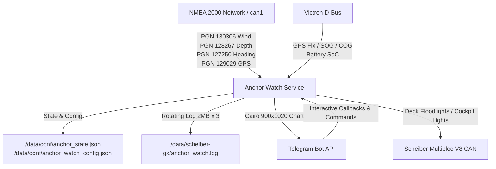

# Smart Anchor Watch & Multi-Sensor Alarm Service (Victron Cerbo GX)

## Overview
The **Smart Anchor Watch Service** (`cerbo/anchor_watch_service.py`) is an autonomous, multi-sensor vessel anchor watch and safety monitoring system running natively on the Victron Cerbo GX (Venus OS). It combines real-time NMEA 2000 telemetry, D-Bus GPS, in-memory pure-Cairo nautical vector chart rendering, Scheiber Multibloc V8 lighting automation, and an interactive Telegram Bot.

> [!IMPORTANT]
> **Strict Relay Isolation**: Cerbo GX physical **Relay 1** is strictly reserved and **NEVER** toggled by the Anchor Watch service. All physical alarm illuminations are routed to the Scheiber switchboard (`/SwitchableOutput/deck_floodlight/State` for physical Output 2 / key code `0x05`, and `/SwitchableOutput/lighting/State` for physical Output 12 / key code `0x07`).

---

## 1. Key Capabilities & Architecture



### 1. Geodesic Anchor Projection & State Persistence
* When **`Drop Anchor`** or **`Reset to Heading`** is triggered, the system projects the seabed anchor coordinates forward from the vessel's current GPS position along its live bow heading by the specified chain rode length:
  $$\text{Anchor Lat/Lon} = \text{Project}(\text{Boat GPS}, \text{Heading}, \text{Rode Length})$$
* **Crash & Reboot Resilience**: The armed state, drop coordinates, rode length, alarm radius, baseline wind direction, and swing track points are continuously saved to `/data/conf/anchor_state.json`. If the service restarts or Cerbo reboots, the watch session is **automatically restored** without manual re-arming.

### 2. Live Cairo Nautical Chart & Strip Plot Rendering
* **North-Up Chart Viewport**: Concentric distance rings (10m / 20m / 50m increments), breadcrumb swing history trail, vessel hull silhouette oriented to true heading, and green dashed safe alarm perimeter.
* **True Wind Rose Badge**: Upper-right floating compass rose with inward-pointing wind vector triangle (`▶`) and source direction label (`FROM NW (14kn)`).
* **Synchronized TWS & TWD Multi-Hour Strip Plot**:
  * Dual-axis time series: True Wind Speed (kn) with cyan area fill on left Y-axis, True Wind Direction (°) with amber dashed trend line on right Y-axis.
  * Adaptive time axis automatically selects clean grid intervals (`3m`, `10m`, `30m`, `1h`, `2h`, `4h`, `6h`) for sessions lasting from 15 minutes to 24+ hours.
  * Vertical gridlines with dual time labels: Clock time (`HH:MM UTC`) and relative offset (`-2h`, `-1h`, `NOW`).
  * Live stats banner: `GUST: XX.X kn | AVG: YY.Y kn | SPAN: Z.Zh`.
* **Zero-Leak Memory Management**: Explicit PyCairo surface disposal (`surface.finish()`, `gc.collect()`) and bounded buffer downsampling (`MAX_HISTORY_POINTS = 1000`) strictly cap memory usage at ~14–20 MB RSS.

### 3. Multi-Sensor Alarms & Safeguards
* 🚨 **Anchor Drag Alarm**: Geofence breach ($D > \text{Alarm Radius}$).
* 💨 **Squall / High Wind Warning**: True Wind Speed $\ge \text{wind\_squall\_gust\_kn}$ (default $25\text{ kn}$).
* 🔄 **Wind Shift Warning**: True Wind Direction shifts by $\ge \text{wind\_shift\_threshold\_deg}$ (default $60^\circ$) from the baseline set angle. *Automatically suppressed in light air when True Wind Speed is $< 3.0\text{ kn}$ (`wind_shift_min_speed_kn`)*.
* 🌊 **Shallow Water Warning**: Water depth sounder drops $\le \text{depth\_alarm\_threshold\_m}$ (default $2.5\text{ m}$).
* 🔋 **Low Battery Warning**: House battery SoC drops $\le \text{battery\_low\_soc\_pct}$ (default $20\%$).

### 4. Physical Deck Light Automation & Telegram Toggle
* When anchor drag is detected, the Scheiber deck floodlights and cockpit lights turn on automatically.
* Tapping **`[ 💡 Deck Lights ]`** in Telegram toggles the physical lights on/off with live button status reflection (`💡 Deck Lights (ON)` vs `💡 Deck Lights (OFF)`).

### 5. Direct Google Maps Navigation
* Every status update, drop confirmation, reset confirmation, and alarm includes a direct clickable link and an inline **`[ 📍 Open in Google Maps ]`** button with the boat's live coordinates.

---

## 2. Telegram Commands & Interactive Keypads

### Commands Reference

| Command | Action |
|---|---|
| `/status`, `/map` | Returns live anchor status, distance, heading, SOG, battery SoC, and rendered vector map. |
| `/menu`, `/start` | Displays the interactive quick button menu. |
| `/settings`, `/alarms` | Opens the interactive settings keypad to toggle alarms or adjust thresholds. |
| `/diag`, `/health`, `/mem` | Displays live service health, memory RSS, sample counts, and D-Bus/N2K status. |
| `/anchor reset` | Re-calculates anchor coordinates from current GPS along current heading using existing rode length. |
| `/anchor off` | Disarms the anchor watch. |

---

## 3. Configuration & State Persistence

* **Configuration**: `/data/conf/anchor_watch_config.json`
* **Active State**: `/data/conf/anchor_state.json`
* **Rotating Log**: `/data/scheiber-gx/anchor_watch.log` (2MB per file, 3 backups)

```json
{
  "telegram_bot_token": "YOUR_TELEGRAM_BOT_TOKEN",
  "telegram_chat_id": "YOUR_TELEGRAM_CHAT_ID",
  "default_rode_m": 50.0,
  "default_safety_margin_m": 10.0,
  "alarm_drag_enabled": true,
  "alarm_squall_enabled": true,
  "alarm_wind_shift_enabled": true,
  "alarm_depth_enabled": true,
  "alarm_battery_enabled": true,
  "depth_alarm_threshold_m": 2.5,
  "wind_squall_gust_kn": 25.0,
  "wind_shift_threshold_deg": 60.0,
  "wind_shift_min_speed_kn": 3.0,
  "battery_low_soc_pct": 20.0,
  "turn_on_deck_lights_on_alarm": true,
  "deck_light_channel": "deck_floodlight",
  "cockpit_light_channel": "lighting"
}
```

---

## 4. Setting Up Loud Phone Alarms

To ensure alarm notifications wake you up reliably during sleep:

### iOS (iPhone / iPad):
1. Open the Anchor Watch Bot chat in Telegram.
2. Tap the Bot title at the top $\rightarrow$ **Notifications** $\rightarrow$ **Sound**.
3. Choose a distinct loud alert tone (e.g. *Siren*, *Alarm*, or *Horn*).
4. In iOS Settings $\rightarrow$ **Focus** $\rightarrow$ **Sleep / Do Not Disturb** $\rightarrow$ Add Telegram to **Allowed Apps** so alerts sound even during sleep focus.

### Android:
1. Open the Anchor Watch Bot chat in Telegram.
2. Tap the Bot title $\rightarrow$ **Notifications** $\rightarrow$ **Customize**.
3. Set **Priority** to **Urgent / High** and select a loud siren/alarm sound.

---

## 5. Service Lifecycle & Diagnostics

The service is managed by `runit` and automatically initialized on boot via `/data/rc.local`:

```bash
# Check service status & uptime
svstat /service/anchor-watch

# Restart service
svc -t /service/anchor-watch

# View live service logs with memory metrics & alarm history
tail -F /data/scheiber-gx/anchor_watch.log
```
