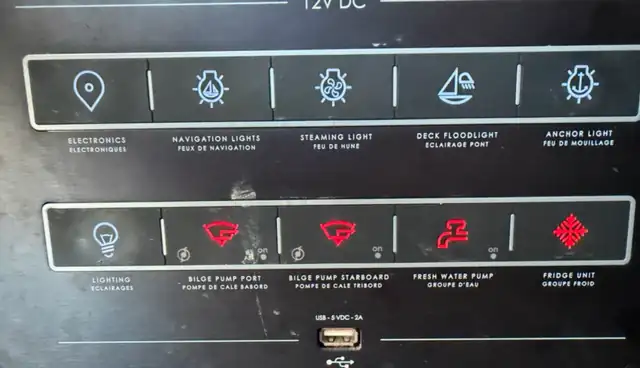

# Scheiber Multibloc V8 10-function control panel

This section documents a labelled reverse-engineering capture of a Scheiber 10-function marine control panel and the CAN behavior associated with its buttons, output-state feedback, bilge modes, and fresh-water-pump running feedback.

The observed panel is marked:

```text
SCHEIBER 41.96012.01 000000
V08.15.01 000276 756-20
```

The supplied panel photograph is stored at [`control-panel-reference.webp`](control-panel-reference.webp).



> **Critical physical requirement:** the control panel must first be physically connected with its normal Scheiber cable (X1/X2 daisy-chain CAN connection) to the rest of the vessel's Scheiber Multibloc V8 network. The observations below were made with the panel participating in that complete network. Do not assume that a loose panel connected only to a USB-CAN adapter will reproduce the same behavior: output modules, interlocks, feedback, termination, and network power/logic live elsewhere on the Scheiber network.

## Status / confidence

This is reverse-engineered installation evidence, not an OEM protocol specification.

| Item | Status |
|---|---|
| CAN 2.0B, 29-bit extended IDs, 250 kbit/s | established for Multibloc V8 and consistent with capture |
| Panel source fields `RefBloc=48, Coding=1, Subnetwork=0` | decoded from observed IDs |
| `RefBloc=48` name `TABLEAU_VOILIER` | source-derived from pinned Domoticz Multibloc V8 implementation |
| Firmware `08.15.01`, configuration CRC `0x8076` | directly decoded from repeating ALIVE frame |
| Button key map | confirmed by labelled one-action-at-a-time capture |
| Outputs 1-12 map | confirmed by labelled capture + source-derived state-frame layout |
| Water/bilge actual-running input bits | strong controlled-test inference; frame class is source-derived |
| Steaming -> navigation dependency | directly observed |
| External injection of the captured button frames on this exact installation | **not yet live-validated**; format is capture-consistent and source-derived |
| RTR state synchronization on this exact installation | **not yet live-validated**; request mechanism is source-derived |
| Direct output command frame | source-derived, not live-tested, intentionally not exposed by the helper |

## Evidence files

The two supplied `candump -L` files are preserved unmodified:

| File | Purpose | SHA-256 |
|---|---|---|
| [`panel-switch-sequence-2026-08-18.log`](../../data/raw/control-panel-v8/panel-switch-sequence-2026-08-18.log) | labelled function sequence: fridge, water pump, bilges, lights, electronics | `bf035f80627716379f7ea0618ae4f657cd6d82ab84c750f1492176c55c9793f7` |
| [`water-pump-demand-2026-08-18.log`](../../data/raw/control-panel-v8/water-pump-demand-2026-08-18.log) | water-pump enable already ON; tap opened and pump ran | `43feb9b8008e7348a8ca32af723802b2396fac0aee9cbfae46ce5f8664feb875` |
| [`control-panel-reference.webp`](control-panel-reference.webp) | physical control panel reference | `eef58d0f7a594cf7aa7d7546d4deec34d4b2d158067cddc744772a2a35fa0bc2` |

Original action order for `panel_sequence.log`:

1. fridge ON, OFF;
2. fresh-water pump ON, OFF;
3. starboard bilge AUTO, MANUAL/pumping, OFF;
4. port bilge AUTO, MANUAL/pumping, OFF;
5. cabin/general lighting ON, OFF;
6. anchor light ON, OFF;
7. deck floodlight ON, OFF;
8. steaming light ON (navigation lights automatically also turned ON), steaming OFF (navigation remained ON);
9. navigation lights OFF, ON, OFF;
10. navigation electronics/chart plotter ON, OFF.

## Protocol basis

The independent protocol cross-check is the open-source Domoticz Multibloc V8 implementation, pinned here so later work can reproduce exactly which source was used:

```text
repository: domoticz/domoticz
commit:     11d95f0c7afedabc6b4c6fef2de971eecd9ee278
file:       hardware/USBtin_MultiblocV8.cpp
```

Relevant source-derived facts, paraphrased rather than copied:

- CAN ID fields use frame type in bits selected by `0x1FFE0000`, module/reference by `0x0001FF80`, coding by `0x78`, and subnetwork by `0x07`.
- frame type `512` is `SFSP_SWITCH`;
- frame type `266` is `E_TOR` (digital inputs);
- frame types `267..282` are paired digital-output-state frames;
- an SFSP switch frame has DLC 5: a 4-byte switch/device ID followed by a key code;
- bit `0x80` of the key code represents press/ON-style input state; the same key with `0x80` cleared represents release;
- the implementation can synthesize virtual switch events on CAN using a switch ID of `0x00000001`;
- output-state frames use byte 2 / byte 6 bit 0 for the two command states and byte 0 / byte 4 for level;
- output-state reads are requested using CAN RTR frames.

This source cross-check is important because it explains the structure seen in the labelled capture instead of relying only on pattern matching.

## CAN identity of this panel

The repeating ALIVE frame is:

```text
00001808#080F018076
```

Decoded:

```text
frame type        0 (ALIVE)
reference         48
coding            1
subnetwork        0
firmware          08.15.01
configuration CRC 0x8076
```

The version bytes independently match the version printed on the panel.

The pinned Domoticz name table calls reference 48 `TABLEAU_VOILIER`. This is a protocol reference name, not a claim about the boat model or marketing name of the photographed panel.

## Button-event frame: momentary input, not ON/OFF command

The physical keys generate CAN ID:

```text
0x04001808
```

Payload observed:

```text
00 00 00 01 KK
```

where `KK` is the key code. Press sets bit `0x80`; release clears it.

For the fridge, key `0x0B`:

```text
04001808#000000018B   press
04001808#000000010B   release
```

The important semantic point is:

> A button press does **not** mean ON, and a release does **not** mean OFF. The pair means only "this panel control was pressed, then released." The Scheiber configuration decides the resulting state.

Therefore repeated presses may toggle a two-state circuit, select a bilge mode, or trigger compound logic such as the steaming/navigation relationship.

### Why a desired-state controller must not assume OFF at startup

At software startup every controlled function should initially be `UNKNOWN`, not `OFF`.

A safe desired-state algorithm is:

```text
startup -> UNKNOWN
            |
            +-- observe/request actual output state
                    |
                    v
                  ON/OFF
                    |
requested ON + actual OFF -> emit one momentary key press
requested ON + actual ON  -> do nothing
requested OFF + actual ON -> emit one momentary key press
requested OFF + actual OFF-> do nothing
```

Do **not** force all outputs OFF merely to establish a baseline. In particular, doing so to the bilge functions can disable automatic bilge protection.

## Complete key/output map

State IDs are paired: one CAN frame contains two consecutive logical outputs.

| Panel function | Key | Press byte | Output | State CAN ID | Slot |
|---|---:|---:|---:|---|---:|
| Electronics / chart plotter | `0x02` | `0x82` | 1 | `0x02161808` | 1 |
| Deck floodlight | `0x05` | `0x85` | 2 | `0x02161808` | 2 |
| Navigation lights | `0x03` | `0x83` | 3 | `0x02181808` | 1 |
| Anchor light | `0x06` | `0x86` | 4 | `0x02181808` | 2 |
| Steaming light | `0x04` | `0x84` | 5 | `0x021A1808` | 1 |
| Port bilge AUTO | `0x08` | `0x88` | 6 | `0x021A1808` | 2 |
| Port bilge MANUAL | `0x0C` | `0x8C` | 7 | `0x021C1808` | 1 |
| Starboard bilge AUTO | `0x09` | `0x89` | 8 | `0x021C1808` | 2 |
| Starboard bilge MANUAL | `0x0D` | `0x8D` | 9 | `0x021E1808` | 1 |
| Fresh-water pump enabled | `0x0A` | `0x8A` | 10 | `0x021E1808` | 2 |
| Fridge unit | `0x0B` | `0x8B` | 11 | `0x02201808` | 1 |
| General/cabin lighting | `0x07` | `0x87` | 12 | `0x02201808` | 2 |

The machine-readable copy is [`panel_mapping.json`](panel_mapping.json).

## Output-state frame layout

For each paired state frame, the open-source Multibloc V8 decoder interprets:

```text
byte 0   slot 1 level
byte 2   slot 1 flags: bit0=command/on, bit1=blink
byte 4   slot 2 level
byte 6   slot 2 flags: bit0=command/on, bit1=blink
```

Bytes 1, 3, 5 and 7 are intentionally left unresolved here.

Examples from the labelled capture:

```text
02201808#0000010100000000
               ^
               output 11 / fridge command-state bit = 1 -> ON

02201808#0000000000000101
                           ^
                           output 12 / lighting command-state bit = 1 -> ON
```

The decoder uses the source-defined flag positions, not the visually convenient trailing `01` bytes.

## Labelled evidence by function

### Fridge

Capture lines 18-21:

```text
04001808#000000018B   fridge press
02201808#0000010100000000   output 11 ON
04001808#000000010B   fridge release
```

Lines 34-37 repeat the same key but output 11 becomes OFF. This proves the key is a momentary/toggle request rather than a dedicated ON command.

### Fresh-water pump enable

Lines 47-50:

```text
04001808#000000018A
021E1808#0000000000000101   output 10 ON
04001808#000000010A
```

Lines 65-68 repeat key `0x0A` and output 10 becomes OFF.

This output means **water-pump system enabled**, not necessarily motor currently running.

### Starboard bilge

AUTO, lines 75-79:

```text
key 0x09 -> output 8 ON
```

MANUAL, lines 85-89:

```text
key 0x0D -> output 9 ON
02141808#04 -> starboard bilge running feedback
```

OFF, lines 93-100:

```text
both 0x09 and 0x0D press/release events are observed
outputs 8 and 9 become OFF
02141808#00 -> no running feedback
```

### Port bilge

AUTO, lines 107-111:

```text
key 0x08 -> output 6 ON
```

MANUAL, lines 116-121:

```text
key 0x0C -> output 7 ON
02141808#02 -> port bilge running feedback
```

OFF, lines 127-134:

```text
both 0x08 and 0x0C press/release events are observed
outputs 6 and 7 become OFF
02141808#00 -> no running feedback
```

This suggests a three-state interpretation for normal observations:

```text
AUTO=0 MANUAL=0 -> OFF
AUTO=1 MANUAL=0 -> AUTO
AUTO=1 MANUAL=1 -> MANUAL / pumping observed
```

`AUTO=0, MANUAL=1` has not been established as a valid or invalid state and should not be invented by software.

### General/cabin lighting

```text
key 0x07 -> output 12
```

ON is lines 143-146; OFF is lines 157-160.

### Anchor light

```text
key 0x06 -> output 4
```

ON is lines 169-173; OFF is lines 180-183.

### Deck floodlight

```text
key 0x05 -> output 2
```

ON is lines 188-192; OFF is lines 198-200.

### Steaming light and navigation dependency

This is the strongest reason to emulate the panel key instead of directly forcing an output.

When steaming was turned ON, lines 207-215 contain:

```text
key 0x04 steaming press
key 0x03 navigation press
output 5 steaming ON
output 3 navigation ON
```

When steaming was then turned OFF, lines 223-226 clear output 5 only. Navigation output 3 remains ON.

Thus the configured Scheiber logic is effectively:

```text
steaming ON  -> ensure navigation ON
steaming OFF -> turn steaming OFF, leave navigation unchanged
```

Navigation was then explicitly toggled OFF/ON/OFF at lines 253-284 with key `0x03` and output 3 following the requested sequence.

### Electronics/chart plotter

```text
key 0x02 -> output 1
```

ON is lines 292-295; OFF is lines 305-307.

## Actual pump-running feedback (`0x02141808`)

CAN ID `0x02141808` decodes by the Multibloc V8 frame-type field as `E_TOR`, i.e. digital inputs.

Controlled tests correlate its first-byte bits as:

| Mask | Inferred signal | Evidence |
|---:|---|---|
| `0x01` | fresh-water pump actually running / demand active | tap-open capture |
| `0x02` | port bilge actually running | port MANUAL test |
| `0x04` | starboard bilge actually running | starboard MANUAL test |

The second capture is particularly useful. The water-pump enable was already ON before capture. Opening the tap produced:

```text
02141808#01
```

and roughly 3.54 seconds later, when the pump stopped:

```text
02141808#00
```

Therefore software can distinguish:

```text
output 10 state = fresh-water-pump system ENABLED
E_TOR bit 0    = pump currently RUNNING / demand active
```

The physical origin of that input (relay feedback, pressure-switch signal, current sensing, etc.) is not established by the CAN capture and must remain unspecified.

## Other observed panel frames

### `0x04081808` — SFSP synchronization

This decodes to frame type 516 (`SFSP_SYNCHRO`) for the same panel source. It appears around some physical key presses with data such as:

```text
04081808#040018088B01
```

Its exact semantics are not required for the current button map. The pinned Domoticz virtual-switch implementation sends the `SFSP_SWITCH` event itself; it does not require reproducing this captured synchronization frame for its virtual key injection path.

### `0x04020000` — SFSP LED command

This decodes to frame type 513 (`SFSP_LED_CMD`). During navigation-light changes the capture includes patterns such as:

```text
04020000#FFFF111111111111
04020000#FFFF222222222222
```

The relationship to panel indicator illumination is plausible from the frame type and timing, but payload semantics are not decoded here.

### `0x02041808` — analog frame, unresolved

This is frame type 258 (`E_ANA_1_TO_4`) from the same panel source and varies frequently. It is preserved in the raw captures but not assigned a function without a controlled test.

## Reproduce passive capture and decoding

Configure SocketCAN at 250 kbit/s:

```bash
sudo ip link set can1 down 2>/dev/null || true
sudo ip link set can1 type can bitrate 250000 restart-ms 100
sudo ip link set can1 up
```

Again: attach the CAN interface as a correctly wired tap to the **already connected and correctly terminated Scheiber network**. Do not power the panel/network from a USB-CAN adapter unless the adapter and installation wiring explicitly support that arrangement.

Capture:

```bash
candump -L can1 > panel_test.log
```

Decode the supplied evidence:

```bash
python3 scripts/scheiber_v8_panel.py \
  --log data/raw/control-panel-v8/panel-switch-sequence-2026-08-18.log
```

Machine-readable JSON-lines:

```bash
python3 scripts/scheiber_v8_panel.py \
  --log data/raw/control-panel-v8/panel-switch-sequence-2026-08-18.log \
  --json
```

Live monitor (requires `python-can`):

```bash
python3 scripts/scheiber_v8_panel.py --monitor --channel can1
```

## Reproduce a panel-style key event

The helper is deliberately dry-run by default:

```bash
python3 scripts/scheiber_v8_panel.py --press fridge_unit --channel can1
```

It prints:

```text
press:   cansend can1 04001808#000000018B
release: cansend can1 04001808#000000010B
```

The captured physical press/release intervals are around 0.12-0.17 s for the simple functions, so the helper defaults to 150 ms.

To actually transmit:

```bash
python3 scripts/scheiber_v8_panel.py \
  --press fridge_unit \
  --channel can1 \
  --transmit
```

Equivalent shell sequence:

```bash
cansend can1 04001808#000000018B
sleep 0.15
cansend can1 04001808#000000010B
```

> **Active-injection status:** the frame pattern is directly captured from the physical panel and matches the independent Multibloc V8 virtual-switch implementation, but an externally injected `0x04001808` key press has not yet been recorded as a successful live validation on this installation. Keep the first test non-critical and observe the resulting state frame.

## Synchronizing state instead of forcing a known startup state

The open-source Multibloc V8 implementation requests output-state frames with CAN RTR. For this panel the six state IDs are:

```text
02161808   outputs 1-2
02181808   outputs 3-4
021A1808   outputs 5-6
021C1808   outputs 7-8
021E1808   outputs 9-10
02201808   outputs 11-12
```

`can-utils` form:

```bash
cansend can1 02161808#R8
cansend can1 02181808#R8
cansend can1 021A1808#R8
cansend can1 021C1808#R8
cansend can1 021E1808#R8
cansend can1 02201808#R8
```

The helper can emit them:

```bash
python3 scripts/scheiber_v8_panel.py --query-states --channel can1
```

and transmit only with:

```bash
python3 scripts/scheiber_v8_panel.py --query-states --channel can1 --transmit
```

> RTR state querying is source-derived but has not yet been live-validated against this exact panel/network capture. Until it is validated, a controller should also learn state from naturally observed state frames and refuse desired-state actions while state remains `UNKNOWN`.

## Desired-state control design

Do not expose a naive API such as `fridge_toggle()` to higher-level automation if the UI expects explicit ON/OFF state. Instead keep a state cache:

```python
actual = {
    "fridge_unit": None,       # None == UNKNOWN
    "fresh_water_pump": None,
    # ...
}
```

Update it only from state frames. Before acting:

```text
if desired == actual:
    no CAN transmission
elif actual is UNKNOWN:
    synchronize/wait; do not guess
else:
    send exactly one panel-style press/release
    wait for the expected state transition
    if no confirmation arrives, report failure; do not blindly toggle again
```

For the bilges, represent `OFF`, `AUTO`, and `MANUAL` explicitly instead of treating the physical control as a simple boolean.

## Why direct output forcing is intentionally not used

The pinned open-source implementation also contains a direct digital-output command format (`type_CMD_S_TOR`, frame type 283). For this panel's source fields that would lead to CAN ID `0x02361808`, with output number/command/level fields in a four-byte payload.

That path is **not** exposed by `scripts/scheiber_v8_panel.py` because:

1. it has not been live-tested on this installation;
2. it may bypass panel/network interlocks;
3. the steaming/navigation test proves that configured compound behavior matters;
4. bilge safety should remain owned by the Scheiber logic unless a direct-control design is separately validated.

Panel-event emulation is the preferred experimental path.

## First active validation to perform next

Use a non-critical load such as the cabin/general lighting or deck floodlight.

1. Confirm the physical panel is connected to the complete Scheiber network.
2. Start `candump -L can1` in one terminal.
3. Confirm the decoder knows the current state, or physically establish and observe it.
4. Dry-run the helper and verify the intended key.
5. Send exactly one press/release pair.
6. Confirm the expected `02xx1808` output-state frame changes once.
7. Confirm the panel LED/display also follows.
8. Send one more press/release and confirm it returns to the previous state.
9. Only after that validate RTR startup synchronization.
10. Do not make bilge functions the first transmission test.

Record the resulting capture and add it here as the first **external injection validation**.

## Files for future-agent handoff

- [`README.md`](README.md) — canonical human-readable findings and procedure.
- [`panel_mapping.json`](panel_mapping.json) — machine-readable map and confidence notes.
- [`scripts/scheiber_v8_panel.py`](../../scripts/scheiber_v8_panel.py) — offline/live decoder, dry-run button generator, optional explicit transmission, RTR state-query helper.
- [`HANDOFF.md`](HANDOFF.md) — concise future-agent rules, known/unknown boundary, and next validation steps.
- [`data/raw/control-panel-v8/`](../../data/raw/control-panel-v8/) — immutable supplied evidence.
- [`control-panel-reference.webp`](control-panel-reference.webp) — physical label/layout reference.

When later evidence changes a mapping, preserve the old raw capture and update the confidence/evidence notes rather than rewriting history.
